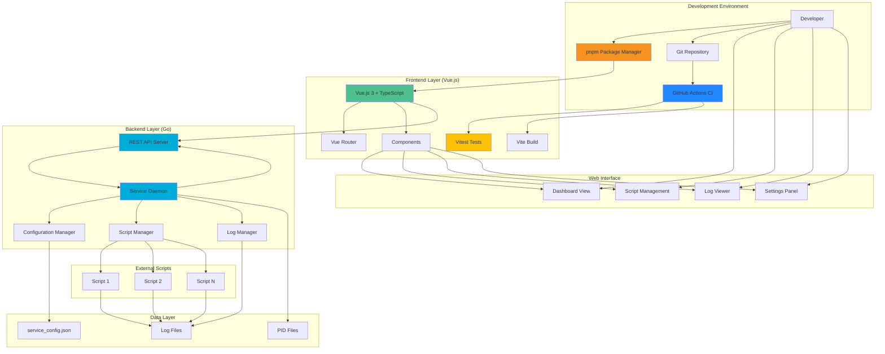

# Run Script Service

A high-performance, configurable Go-based service that executes multiple scripts at configurable intervals with built-in web interface, automatic logging, and daemon management.

## Architecture



## Features

- **Daemon Management**: Built-in background process management with PID files
- **Modern Frontend**: Vue.js 3 with TypeScript, Vite build system, and pnpm package management
- **Web Interface**: Real-time monitoring and control via HTTP (http://localhost:8080)
- **Multiple Scripts**: Support for multiple scripts with individual configurations
- **Configurable Intervals**: Set execution frequency in seconds, minutes, or hours per script
- **Automatic Logging**: All script execution results are logged with rotation
- **Cross-Platform**: Single Go binary, no external dependencies
- **RESTful API**: Web API for programmatic control
- **CI/CD Integration**: GitHub Actions with automated testing and pnpm enforcement

## Quick Start

1. **Install dependencies and build the service:**
   ```bash
   # One-command setup (requires Node.js 18+ and pnpm)
   make quickstart

   # Alternative: Manual steps
   # cd web/frontend && pnpm install && cd ../..
   # make build-all
   ```

2. **Add a script to execute:**
   ```bash
   # Create a test script
   echo '#!/bin/bash\necho "Hello from script: $(date)"' > test.sh
   chmod +x test.sh

   # Add it to the service
   ./run-script-service add-script --name=test --path=./test.sh --interval=30s
   ```

3. **Start the service in background:**
   ```bash
   ./run-script-service daemon start
   ```

4. **Check status and access web interface:**
   ```bash
   ./run-script-service daemon status
   # Web interface: http://localhost:8080
   ```

### Frontend Development Setup (Optional)

If you want to work on the Vue.js frontend:

1. **Install Node.js and pnpm:**
   ```bash
   # Install Node.js 18+ from nodejs.org
   # Install pnpm globally
   npm install -g pnpm@8
   ```

2. **Setup frontend development:**
   ```bash
   cd web/frontend
   pnpm install    # Install dependencies (npm is blocked)
   pnpm dev        # Start development server at http://localhost:5173
   ```

3. **Frontend development workflow:**
   ```bash
   pnpm test           # Run all tests
   pnpm test:watch     # Run tests in watch mode
   pnpm type-check     # TypeScript type checking
   pnpm build          # Build for production
   ```

**Note:** The project enforces pnpm usage - npm commands will be rejected by pre-install hooks.

## Usage

### Daemon Management

| Command | Description |
|---------|-------------|
| `./run-script-service daemon start` | Start the service in background |
| `./run-script-service daemon stop` | Stop the background service |
| `./run-script-service daemon status` | Show service status |
| `./run-script-service daemon restart` | Restart the service |
| `./run-script-service daemon logs` | Show service logs |

### Script Management

| Command | Description |
|---------|-------------|
| `./run-script-service add-script --name=<name> --path=<path> --interval=<time>` | Add a new script |
| `./run-script-service list-scripts` | List all configured scripts |
| `./run-script-service enable-script <name>` | Enable a script |
| `./run-script-service disable-script <name>` | Disable a script |
| `./run-script-service remove-script <name>` | Remove a script |
| `./run-script-service run-script <name>` | Run a script once |

### Configuration

| Command | Description |
|---------|-------------|
| `./run-script-service show-config` | Display current configuration |
| `./run-script-service set-web-port <port>` | Set web server port |
| `./run-script-service logs --script=<name>` | View script execution logs |

### Interval Format Examples

- `30` - 30 seconds
- `5m` - 5 minutes
- `2h` - 2 hours
- `3600` - 3600 seconds (1 hour)

## Files Structure

```
run-script-service/
├── main.go                   # Main service daemon (Go)
├── go.mod                    # Go module definition
├── go.sum                    # Go dependencies checksum
├── run-script-service        # Compiled binary
├── service_config.json       # Configuration file (auto-generated)
├── daemon.log                # Service daemon logs
├── run.log                   # Legacy script execution log
├── logs/                     # Individual script logs
│   ├── script1.log
│   └── script2.log
├── web/                      # Web interface components
│   ├── server.go            # Go web server
│   ├── frontend/            # Vue.js frontend application
│   │   ├── package.json     # pnpm package configuration
│   │   ├── pnpm-lock.yaml   # pnpm lock file
│   │   ├── vite.config.ts   # Vite build configuration
│   │   ├── tsconfig.json    # TypeScript configuration
│   │   ├── vitest.config.ts # Vitest test configuration
│   │   ├── src/             # Vue.js source code
│   │   │   ├── main.ts      # Application entry point
│   │   │   ├── App.vue      # Root component
│   │   │   ├── router/      # Vue Router configuration
│   │   │   ├── views/       # Page components (Dashboard, Scripts, Logs, Settings)
│   │   │   ├── components/  # Reusable Vue components
│   │   │   ├── composables/ # Vue composition API logic
│   │   │   ├── services/    # API service layer
│   │   │   ├── types/       # TypeScript type definitions
│   │   │   └── assets/      # Static assets
│   │   ├── tests/           # Frontend test suites
│   │   │   ├── unit/        # Unit tests with Vitest
│   │   │   └── integration/ # Integration tests
│   │   └── dist/            # Built frontend assets (generated)
│   └── static/              # Legacy static files (being migrated)
├── service/                  # Core service components
│   ├── config.go            # Configuration management
│   ├── script_manager.go    # Script execution management
│   └── ...
├── .github/                  # GitHub Actions CI/CD
│   └── workflows/
│       └── ci.yml           # CI pipeline with pnpm support
├── .pre-commit-config.yaml   # Pre-commit hooks configuration
├── Makefile                  # Build automation
├── plans/                    # Development plans
├── docs/                     # Documentation
└── README.md                 # This file
```

## Log Format

### Service Logs (`daemon.log`)
Service startup, shutdown, and web interface logs:
```
Multi-script service with web interface started
Running scripts: [test1 test2]
Web interface available at http://localhost:8080
System metrics broadcasting started
```

### Script Logs (`logs/<script-name>.log`)
Individual script execution logs with JSON format:
```json
{"timestamp":"2024-01-15T14:30:00Z","script":"test1","exit_code":0,"duration":150,"stdout":"Hello World","stderr":""}
{"timestamp":"2024-01-15T14:30:30Z","script":"test1","exit_code":0,"duration":142,"stdout":"Hello World","stderr":""}
```

## Web Interface

Access the web interface at `http://localhost:8080` for:

- **Dashboard**: View running scripts and system metrics
- **Script Management**: Add, edit, enable/disable scripts
- **Log Viewer**: Real-time log monitoring
- **Configuration**: Adjust settings via web UI

### API Endpoints

- `GET /api/scripts` - List all scripts
- `POST /api/scripts` - Add new script
- `PUT /api/scripts/{name}` - Update script
- `DELETE /api/scripts/{name}` - Remove script
- `POST /api/scripts/{name}/run` - Execute script once
- `GET /api/logs/{name}` - Get script logs

## Configuration

### Script Configuration

Each script has individual settings:

```json
{
  "name": "backup",
  "path": "/path/to/backup.sh",
  "interval": 3600,
  "enabled": true,
  "max_log_lines": 100,
  "timeout": 300
}
```

### Service Configuration (`service_config.json`)

Global service settings:

```json
{
  "web_port": 8080,
  "scripts": [
    {
      "name": "test1",
      "path": "./test1.sh",
      "interval": 300,
      "enabled": true,
      "max_log_lines": 100,
      "timeout": 0
    }
  ]
}
```

## Troubleshooting

### Check Service Status
```bash
./run-script-service daemon status
```

### View Service Logs
```bash
./run-script-service daemon logs
```

### View Script Logs
```bash
./run-script-service logs --script=<script-name>
```

### Manual Testing
```bash
# Build the binary
go build -o run-script-service main.go

# Test a script manually
./run-script-service run-script <script-name>

# Run service in foreground (for debugging)
./run-script-service run

# Check configuration
./run-script-service show-config
```

### Common Issues

1. **Permission denied**: Ensure scripts are executable with `chmod +x`
2. **Service won't start**: Check daemon logs with `./run-script-service daemon logs`
3. **Script not found**: Verify script path in configuration with `./run-script-service list-scripts`
4. **Web interface not accessible**: Check if port 8080 is available or change with `./run-script-service set-web-port <port>`

## Requirements

### Quick Start Requirements
- **Node.js 18+** (for frontend build process)
- **pnpm 8+** (package manager - enforced, npm not allowed)
- **Go 1.21+** (for building the service)

### Backend (Go Service)
- Go 1.21+ (for building from source)
- No runtime dependencies (pure Go binary)
- Cross-platform compatible (Linux, macOS, Windows)

### Frontend Development (Optional - for UI development)
- Node.js 18+ (required for frontend development)
- pnpm 8+ (package manager - enforced, npm is not allowed)
- Modern browser with ES2020+ support

### Development Tools (Optional)
- Python 3.8+ with pip (for pre-commit hooks)
- Git (for version control and CI/CD)

## Development

This project follows a structured development approach with detailed plans for each feature enhancement.

### Pre-commit Hooks

To maintain code quality, we use the [pre-commit](https://pre-commit.com/) framework for automatic checks:

```bash
# Install pre-commit (requires Python)
pip install pre-commit

# Install hooks for this repository
pre-commit install

# Optional: run on all files
pre-commit run --all-files
```

The pre-commit hooks will automatically:
- Format code with `go fmt`
- Fix imports with `goimports`
- Run linting with `golangci-lint`
- Execute all tests
- Check for trailing whitespace and other common issues

### Development Commands

```bash
# Backend (Go) development
make format              # Format code with go fmt and goimports
make lint               # Run golangci-lint
make test               # Run all Go tests
make build              # Build Go binary
make ci                 # Full CI pipeline (format + lint + test + build)
make clean              # Clean build artifacts

# Frontend (Vue.js) development
cd web/frontend
pnpm install            # Install frontend dependencies
pnpm dev                # Start development server (http://localhost:5173)
pnpm build              # Build frontend for production
pnpm preview            # Preview production build
pnpm test               # Run frontend tests with Vitest
pnpm test:watch         # Run tests in watch mode
pnpm type-check         # TypeScript type checking with vue-tsc
pnpm lint               # Run ESLint (if configured)

# Full stack development
make frontend-install   # Install frontend dependencies
make frontend-build     # Build frontend and integrate with Go
make frontend-test      # Run frontend tests
make full-build         # Build both frontend and backend

# Pre-commit hooks (requires: pip install pre-commit)
pre-commit install      # Install hooks for this repository
pre-commit run --all-files  # Run on all files (Go + Frontend)

# Development workflow
make test-watch         # Run Go tests with file watching (TDD)
```

### Development Plans

The `plans/` directory contains detailed implementation plans for upcoming features:

| Plan | Feature | Status |
|------|---------|--------|
| ~~01-unit-testing.md~~ | Unit Testing Infrastructure | ✅ Completed - Integrated into project |
| ~~02-tdd-workflow.md~~ | TDD Development Workflow | ✅ Completed - See [docs/development.md](docs/development.md) |
| ~~03-multi-script-support.md~~ | Multi-Script Support | ✅ Completed - Core functionality implemented |
| ~~04-multi-log-management.md~~ | Multi-Log Management | ✅ Completed - Logging system implemented |
| ~~05-web-framework.md~~ | Web Framework Setup | ✅ Completed - Web interface implemented |
| ~~06-web-ui-basic.md~~ | Basic Web UI | ✅ Completed - Web UI available |
| ~~07-web-editing.md~~ | Web Editing Features | ✅ Completed - Management interface implemented |
| ~~08-real-time-monitoring.md~~ | Real-time System Monitoring | ✅ Completed - WebSocket real-time updates with 32/32 E2E tests passing |
| ~~09-vue-frontend-migration.md~~ | Vue.js Frontend Migration | ✅ Completed - Modern Vue.js 3 + TypeScript frontend with pnpm |
| ~~[10-tdd-frontend-fixes.md](plans/10-tdd-frontend-fixes.md)~~ | TDD Frontend Data Display Fixes | ✅ Completed - 100% E2E test pass rate achieved |
| ~~[authentication-plan.md](plans/authentication-plan.md)~~ | Web Interface Authentication | ✅ Completed - Secret key authentication with session management |

### Development Workflow

**Current Active Development Standards:**
- **TDD Workflow**: All development must follow Test-Driven Development principles outlined in [docs/development.md](docs/development.md)
- **Code Quality**: Automated linting, formatting, and testing via `make ci`
- **Small Iterations**: Feature development in small, reviewable increments

**Completed Plans Integration:**
Most development plans (Plans 01-07) have been successfully implemented and their guidelines integrated into the main project structure and documentation. Future enhancements are tracked in remaining plan files.

### Getting Started with Development

1. Choose a plan from the table above
2. Review the prerequisites
3. Follow the implementation steps using TDD approach
4. Ensure all acceptance criteria are met
5. Update the plan status in this README

### Contributing

When working on features:
- Follow the TDD workflow established in Plan 02
- Update documentation as you implement
- Ensure all tests pass before submitting changes
- Update the plan status table above

## License

This project is provided as-is for educational and practical use.
